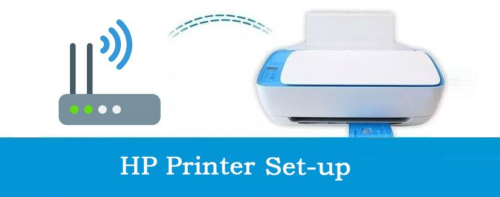

## 123.hp.com/setup

**[HP printer setup]()** is a well-known American multinational information technology company that manufactures a wide range of products, including computers, laptops, printers, and other hardware and software solutions. HP printers are some of the most popular and widely used printers in the world. Install it from **[123.hp.com/setup]()** on the device you want to print from, and then use it to set up the printer connection.

## HP Printer Types

* Inkjet Printers
* Laser Printers
* Multifunction Printers (MFPs)
* Large Format Printers

## Features OF HP Printers

* Variable printing speeds.
* Adjustable print resolutions.
* Wireless and Bluetooth connectivity.
* Mobile printing with apps.
* Touchscreen displays for easy navigation.
* Auto Document Feeders (ADFs) for scanning and copying.
* Security features like secure boot.
* Energy-efficient and ENERGY STAR certification.
* Print apps and cloud printing solutions.
* Automatic ink/toner replenishment programs.
* Voice assistant integration.
* Remote management for networked printers.

## System Requirements in Windows setup 

* Windows 10 – 32-bit or 64-bit processor
* Windows 8.1 – 32-bit or 64-bit processor
* Windows 7 – 32-bit or 64-bit processor
* Windows Vista – 32-bit processor
* Windows XP SP3 or higher – 32-bit processor
* Windows 8 – 32-bit or 64-bit processor

## Setup HP Printer : 123.hp.com

1. Place the HP printer on a smooth surface.
2. Connect the printer to the power outlet and turn it on.
3. Set the preferred language and region.
4. Install genuine ink.
5. Load paper into the paper tray.
6. Print an alignment page.
7. Open a web browser and go to **[123.hp.com]()**.
8. Download the printer driver to complete the setup.

## Download and Install HP Printer Driver

1. Identify your printer model.
2. Visit the official **[hp123.com/setup]()** website.
3. Enter your printer model number.
4. Select your operating system.
5. Download the driver for your OS.
6. Run the downloaded driver installer.
7. Follow on-screen instructions.
8. Connect the printer if prompted.
9. Complete the installation.
10. Restart your computer if required.
11. Check for driver updates periodically.
